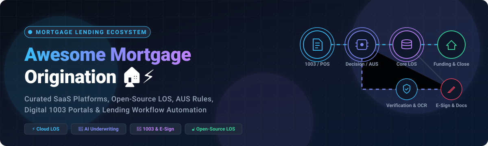
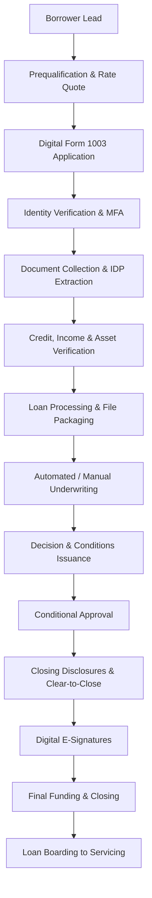
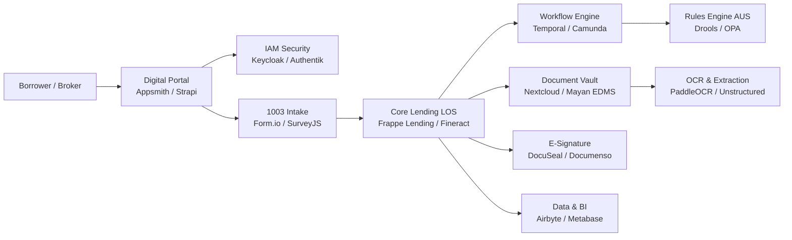
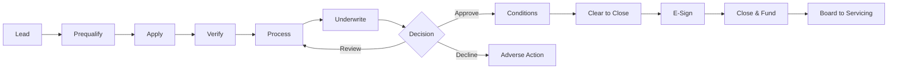

<p align="center">
  
</p>

# 🏠 Awesome Mortgage Origination [](https://github.com/ishandutta2007/Awesome-Awesome-Awesome)

<p align="center">
  <a href="https://github.com/ishandutta2007/Awesome-Awesome-Awesome"></a><a href="https://discord.gg/jc4xtF58Ve"></a>
  <a href="https://github.com/ishandutta2007/Awesome-Mortgage-Origination/stargazers"></a>
  <a href="https://github.com/ishandutta2007/Awesome-Mortgage-Origination/network/members"></a>
  <a href="https://github.com/ishandutta2007/Awesome-Mortgage-Origination/pulls"></a>
  <a href="https://github.com/ishandutta2007/Awesome-Mortgage-Origination/blob/main/LICENSE"></a>
  <a href="https://github.com/ishandutta2007"></a>
</p>

---

## ⚡ Top Mortgage Origination Platform Ecosystem

> 🌟 **The definitive curated directory of Mortgage Loan Origination Systems (LOS), Digital Point-of-Sale (POS) Lending Portals, Automated Underwriting Systems (AUS), 1003 Loan Intake Workflows, E-Closing Solutions, and Open-Source Lending Infrastructure.**

**Keywords**: `Mortgage Origination Software` • `Loan Origination System (LOS)` • `Digital Mortgage POS` • `Automated Underwriting Engine (AUS)` • `1003 Loan Application` • `MISMO 3.4 Standards` • `Mortgage CRM` • `Fintech Lending Architecture` • `Mortgage Document Extraction & OCR` • `E-Sign & E-Closing Infrastructure`

**Last updated: August 2026**

---

This repository tracks notable **SaaS/hosted platforms** and **open-source projects** for **Mortgage Origination and Loan Origination Systems (LOS)**. These platforms help mortgage lenders, banks, credit unions, brokers, fintechs, and financial institutions manage the entire mortgage lifecycle—from digital borrower applications and automated document collection through credit decisioning, underwriting, condition clearance, disclosure compliance, closing, and funding.

Typical Mortgage Origination capabilities include:
- 📱 **Digital Borrower Intake (POS / 1003 Forms)** & Multi-Channel Portals
- 🔍 **Automated Verification (VOI, VOE, VOA, Credit & Asset Pulls)**
- 🤖 **Automated Underwriting Systems (AUS)** & Configurable Decision Rules
- 📁 **Intelligent Document Processing (IDP), Classification & OCR Extraction**
- 🛡️ **Regulatory Compliance (TRID, RESPA, TILA, HMDA, ECOA)** & Automated Disclosures
- ✍️ **E-Signatures, Smart Vaults & Digital E-Closing Coordination**
- 🔌 **Secondary Market Pricing (PPE) & Servicing Boarding Integrations**

---

## 📑 Table of Contents

* [🏢 SaaS/Hosted Platforms](#-saashosted-platforms)
* [🔓 Open-Source GitHub Projects](#-open-source-github-projects)
  * [🏦 Dedicated Lending & Loan Origination Platforms](#-dedicated-lending--loan-origination-platforms)
  * [👥 Mortgage & Lending CRM Foundations](#-mortgage--lending-crm-foundations)
  * [📱 Loan Application & Borrower Portal Builders](#-loan-application--borrower-portal-builders)
  * [⚙️ Workflow & Business Process Automation (BPMN)](#️-workflow--business-process-automation-bpmn)
  * [📝 Forms & Digital Applications](#-forms--digital-applications)
  * [📂 Document Management & Mortgage Files](#-document-management--mortgage-files)
  * [🔍 Document Extraction, OCR & AI Processing](#-document-extraction-ocr--ai-processing)
  * [🔐 Identity & Access Management (IAM)](#-identity--access-management-iam)
  * [✍️ E-Signature & Agreement Infrastructure](#️-e-signature--agreement-infrastructure)
  * [🔄 Data Integration & Lending APIs](#-data-integration--lending-apis)
  * [🌐 API Infrastructure & Gateways](#-api-infrastructure--gateways)
  * [📊 Analytics & Lending Operations BI](#-analytics--lending-operations-bi)
  * [⚖️ Rules, Decisioning & Underwriting Engines](#-rules-decisioning--underwriting-engines)
* [🧩 Additional Strong Open-Source Options](#-additional-strong-open-source-options)
* [🏗️ Frameworks for Building Custom Mortgage Origination Systems](#️-frameworks-for-building-custom-mortgage-origination-systems)
* [🔄 Mortgage Origination Workflow](#-mortgage-origination-workflow)
* [📐 Open-Source Mortgage Origination Architecture](#-open-source-mortgage-origination-architecture)
* [🧱 Mortgage Origination Data Model](#-mortgage-origination-data-model)
* [🎯 Common Mortgage Origination Features](#-common-mortgage-origination-features)
* [🔄 Mortgage Origination Lifecycle](#-mortgage-origination-lifecycle)
* [🤖 AI-Assisted Mortgage Origination](#-ai-assisted-mortgage-origination)
* [📊 Mortgage Origination KPIs](#-mortgage-origination-kpis)
* [📈 Star History](#-star-history)
* [🤝 How to Contribute](#-how-to-contribute)
* [📜 Disclaimer](#-disclaimer)

---

## 🏢 SaaS/Hosted Platforms

> 📊 **Sector Market Size & Concentration Analysis**: The global Mortgage Loan Origination Software (LOS) & Digital Lending platform market is valued at **$5.8 Billion in 2024** and is projected to surpass **$12.4 Billion by 2032**, expanding at a **CAGR of ~11.8%**. The overall ecosystem is **moderately fragmented** across specialized niches (borrower POS portals, automated document intake, OCR verification, and pricing engines), but features **high concentration at the enterprise core LOS layer**, where top institutional platforms (notably ICE Mortgage Technology Encompass, Finastra Mortgagebot, and nCino) capture the dominant market share among top-tier mortgage lenders, regional banks, and credit unions.

| Product | Company Size / Valuation / Revenue | Description | Starting Pricing | Free Tier / Free Trial Limits |
| :--- | :--- | :--- | :--- | :--- |
| **[Mortgage Cadence](https://www.mortgagecadence.com/)** | **~$200B+ Market Cap**<br>*(Parent Accenture, NYSE: ACN)* | Enterprise mortgage platform (MCP) supporting configurable loan origination, document management, and closing operations. | MCP Essentials starts at ~$1,200/month; Enterprise tier priced by annual closed loan volume. | 30-day guided evaluation sandbox instance with prebuilt workflow templates (no free forever tier). |
| **[ICE Mortgage Technology Encompass](https://www.icemortgagetechnology.com/)** | **~$90B+ Market Cap**<br>*(Parent Intercontinental Exchange, NYSE: ICE; ~$1.2B segment revenue)* | Enterprise loan origination system (LOS) covering application, automated underwriting, compliance, closing, and secondary market delivery. | Starts at ~$1,000/month base platform fee plus ~$40–$120/closed loan for mid-market lenders. | 30-day ICE Developer Connect sandbox access with up to 100 test loan API transactions (no free forever tier). |
| **[ICE Mortgage Technology Consumer Connect](https://www.icemortgagetechnology.com/)** | **~$90B+ Market Cap**<br>*(Parent Intercontinental Exchange, NYSE: ICE; ~$1.2B segment revenue)* | Digital borrower POS and engagement platform connecting consumer applications directly into Encompass origination pipelines. | Starts at ~$300/month add-on base fee (or ~$10–$20/completed digital application). | 30-day test environment bundled within ICE Developer Connect sandbox (no free forever tier). |
| **[Dark Matter Technologies](https://www.darkmattertech.com/)** | **~$70B+ Market Cap**<br>*(Parent Constellation Software / Perseus Group, TSX: CSU; ~$500M+ division valuation)* | Empower LOS platform delivering high-performance origination, integrated pricing engine (PPE), and secondary marketing capabilities. | Bundled LOS packages start at ~$2,000/month base tier (or volume pricing starting at ~$65/closed loan). | 30-day guided test sandbox environment for qualified mortgage lenders (no free forever tier). |
| **[nCino Mortgage](https://www.ncino.com/)** | **~$4.2B Market Cap**<br>*(NASDAQ: NCNO; ~$520M annual revenue)* | Cloud banking and mortgage origination platform providing automated workflow management across consumer and commercial lending. | Starts at ~$2,000/month base enterprise package for financial institutions. | 14-day sales-guided Proof of Value (PoV) sandbox instance (no free forever tier). |
| **[SimpleNexus](https://www.simplenexus.com/)** | **~$4.2B Market Cap**<br>*(Acquired by nCino for $1.2B; NASDAQ: NCNO)* | Mobile-first digital mortgage POS platform connecting borrowers, loan officers, and realtors across the loan lifecycle. | Starts at ~$150/user/month (or ~$1,200/month base subscription for small lending teams). | 14-day guided test portal with pre-configured borrower application flow (no free forever tier). |
| **[Finastra Mortgagebot](https://www.finastra.com/)** | **~$2.0B Annual Revenue**<br>*(Vista Equity Partners portfolio)* | Point-of-sale and loan origination technology providing end-to-end digital lending workflows for banks and credit unions. | Starts at ~$1,500/month base subscription for community financial institutions. | 30-day API evaluation sandbox on Finastra FusionFabric.cloud with mock lending endpoints (no free forever tier). |
| **[MeridianLink Mortgage](https://www.meridianlink.com/)** | **~$1.6B Market Cap**<br>*(NYSE: MLNK; ~$315M annual revenue)* | Digital lending and mortgage origination platform providing automated underwriting, compliance verification, and closing workflows. | Starts at ~$500/month base platform subscription plus per-application transaction fees. | 30-day developer sandbox environment for integration testing and API validation (no free forever tier). |
| **[Blend](https://blend.com/)** | **~$850M Market Cap**<br>*(NYSE: BLND; ~$160M annual revenue)* | Digital origination platform for banks, credit unions, and mortgage providers supporting modern borrower applications, workflow automation, and consumer lending. | Starts at ~$80/user/month for entry point-of-sale licenses; enterprise lending deployments start from ~$1,500/month (or ~$50–$100/loan). | 14-day guided proof-of-concept / sandbox trial with sample loan workflow access on sales approval (no free forever tier). |
| **[Tavant](https://tavant.com/)** | **~$180M Annual Revenue**<br>*(Global fintech services & solutions)* | AI-powered Touchless Lending platform providing modular digital origination, document classification, and automated underwriting. | Modular lending services start at ~$2,500/month (or ~$25/processed document package). | 30-day pilot API sandbox with up to 100 automated document extraction runs (no free forever tier). |
| **[Roostify](https://www.roostify.com/)** | **~$100M Valuation**<br>*(Acquired by CoreLogic / Stone Point & Insight Partners)* | Digital mortgage point-of-sale platform focused on borrower experience, mobile applications, document collection, and loan collaboration. | Starts at ~$1,000/month base platform fee for community lenders (or tiered at ~$15–$30/submitted application). | 14-day guided proof-of-concept environment for evaluating digital intake workflows (no free forever tier). |
| **[Floify](https://www.floify.com/)** | **~$86.5M Valuation**<br>*(Acquired by Porch Group, NASDAQ: PRCH)* | Mortgage POS and automation platform for borrower portals, 1003 applications, automatic document requests, and milestone tracking. | Starter/Individual plan starts at $70/user/month (Team plan starts at $175/month). | 14-day free trial with unlimited test loan creation and full document portal capabilities. |
| **[TurnKey Lender](https://www.turnkey-lender.com/)** | **~$80M Valuation**<br>*(~$20M ARR; Venture-backed)* | Automated lending platform supporting AI-powered loan origination, decisioning, underwriting, servicing, and collections. | Standard tier starts at $500/month (or volume tier starting at ~$10/originated loan). | 14-day free trial with full sandbox environment access and up to 50 test loan applications. |
| **[LendingPad](https://www.lendingpad.com/)** | **~$60M Valuation**<br>*(~$15M ARR; Cloud LOS)* | Cloud-based mortgage LOS designed for brokers, lenders, and institutions supporting real-time collaborative processing and underwriting. | Broker Edition starts at $55/user/month; Lender Edition starts at ~$100/closed loan. | 14-day guided interactive sandbox demo with preloaded pipeline and test borrower records (no free forever tier). |
| **[Calque](https://www.calqueinc.com/)** | **~$40M Valuation**<br>*(Venture-backed Series A)* | Mortgage platform providing "Buy Before You Sell" solutions and guaranteed backup contracts for home purchase workflows. | Free lender partner onboarding ($0/month subscription); borrower fee is $2,000 admin fee + 1% Purchase Price Guarantee upon home sale. | Free forever partner access with zero upfront fees or loan limits; transaction fees apply strictly upon closed transactions. |
| **[Byte Software](https://www.bytesoftware.com/)** | **~$30M Valuation / Revenue**<br>*(CBC Companies / Factual Data division)* | Mortgage loan origination system (BytePro) providing loan workflow management, broker connectivity, compliance checks, and secondary marketing. | Starts at ~$100/user/month (standard single-user desktop) or ~$800/month base server deployment. | 30-day evaluation trial license with sample mortgage pipeline and test loan files (no free forever tier). |

---

## 🔓 Open-Source GitHub Projects

### 🏦 Dedicated Lending & Loan Origination Platforms

* **[Apache Fineract](https://github.com/apache/fineract)** [](https://github.com/apache/fineract/stargazers)
  Industrial open-source core banking and financial-services platform supporting lending products, mortgage portfolios, repayments, accounting, and multi-tenant ledger infrastructure.

* **[Mifos X](https://github.com/openMF/mifosx)** [](https://github.com/openMF/mifosx/stargazers)
  Open-source financial inclusion and lending platform built around Apache Fineract, offering web and mobile interfaces for loan management and credit operations.

* **[Frappe Lending](https://github.com/frappe/lending)** [](https://github.com/frappe/lending/stargazers)
  Comprehensive open-source loan management system built on ERPNext and the Frappe Framework, supporting the lending lifecycle from origination through disbursement, repayment, and accounting.

* **[DigiFi Loan Origination System](https://github.com/getsan4u/loan-origination-system)** [](https://github.com/getsan4u/loan-origination-system/stargazers)
  Modular open-source loan origination system architecture designed for consumer, residential mortgage, and small-business lending workflows.

* **[Mifos Payment Hub EE](https://github.com/openMF/ph-ee-engine)** [](https://github.com/openMF/ph-ee-engine/stargazers)
  Open-source financial infrastructure engine supporting real-time payment rails, disbursement orchestration, and loan settlement.

* **[LendFlow](https://github.com/Hruthik2311/LendFlow)** [](https://github.com/Hruthik2311/LendFlow/stargazers)
  Open-source loan management and recovery application with multi-role access, pipeline tracking, repayment workflows, and borrower notifications.

* **[FinStack No-Code LOS Architecture](https://github.com/FinStack-No-Code-LOS/Loan-Origination-System-Architecture)** [](https://github.com/FinStack-No-Code-LOS/Loan-Origination-System-Architecture/stargazers)
  Open-source architecture and implementation blueprints for assembling an enterprise-grade Loan Origination System using modern open-source stacks.

---

### 👥 Mortgage & Lending CRM Foundations

* **[Odoo](https://github.com/odoo/odoo)** [](https://github.com/odoo/odoo/stargazers)
  Comprehensive open-source enterprise suite featuring robust CRM, accounting, document vaults, customer portals, and workflow engines.

* **[Twenty](https://github.com/twentyhq/twenty)** [](https://github.com/twentyhq/twenty/stargazers)
  Modern, high-performance open-source CRM platform ideal for customizing borrower relations, loan officer pipelines, and broker interactions.

* **[ERPNext](https://github.com/frappe/erpnext)** [](https://github.com/frappe/erpnext/stargazers)
  Full-featured open-source ERP providing CRM, general ledger accounting, loan schedules, and document tracking for lending operations.

* **[SuiteCRM](https://github.com/salesagility/SuiteCRM)** [](https://github.com/salesagility/SuiteCRM/stargazers)
  Enterprise-ready open-source CRM tailored for managing mortgage lead pipelines, broker partner networks, and borrower communications.

* **[EspoCRM](https://github.com/espocrm/espocrm)** [](https://github.com/espocrm/espocrm/stargazers)
  Flexible open-source CRM platform for tracking mortgage applications, borrowers, loan entities, and automated customer journeys.

---

### 📱 Loan Application & Borrower Portal Builders

* **[Strapi](https://github.com/strapi/strapi)** [](https://github.com/strapi/strapi/stargazers)
  Leading open-source headless CMS and API engine for building customized borrower portals and digital mortgage frontends.

* **[Appsmith](https://github.com/appsmithorg/appsmith)** [](https://github.com/appsmithorg/appsmith/stargazers)
  Powerful open-source low-code platform for building underwriter workspaces, loan officer dashboards, and internal mortgage processing tools.

* **[ToolJet](https://github.com/ToolJet/ToolJet)** [](https://github.com/ToolJet/ToolJet/stargazers)
  Open-source low-code framework to connect databases, LOS backends, and mortgage APIs into responsive operational dashboards.

* **[Directus](https://github.com/directus/directus)** [](https://github.com/directus/directus/stargazers)
  Open-source real-time data platform and instant REST/GraphQL API engine for borrower applications and mortgage asset management.

* **[Budibase](https://github.com/Budibase/budibase)** [](https://github.com/Budibase/budibase/stargazers)
  Open-source internal tool platform for assembling multi-step loan intake portals, condition approval forms, and underwriter consoles.

* **[NocoBase](https://github.com/nocobase/nocobase)** [](https://github.com/nocobase/nocobase/stargazers)
  Extensible, private-first no-code platform for crafting tailored mortgage origination pipelines and multi-role operations.

* **[Drupal](https://github.com/drupal/drupal)** [](https://github.com/drupal/drupal/stargazers)
  Enterprise content management and portal framework for secure, authenticated borrower and broker self-service portals.

---

### ⚙️ Workflow & Business Process Automation (BPMN)

* **[n8n](https://github.com/n8n-io/n8n)** [](https://github.com/n8n-io/n8n/stargazers)
  Fair-code workflow automation platform with 400+ nodes to connect borrower intake, email alerts, document generation, and CRM systems.

* **[Apache Airflow](https://github.com/apache/airflow)** [](https://github.com/apache/airflow/stargazers)
  Scalable batch workflow orchestrator for mortgage ETL pipelines, compliance audits, and credit reporting jobs.

* **[Temporal](https://github.com/temporalio/temporal)** [](https://github.com/temporalio/temporal/stargazers)
  Resilient durable execution platform engineered for complex, stateful, long-running mortgage loan approval and closing lifecycles.

* **[Node-RED](https://github.com/node-red/node-red)** [](https://github.com/node-red/node-red/stargazers)
  Low-code event-driven integration framework ideal for connecting legacy banking mainframes with modern mortgage microservices.

* **[Kestra](https://github.com/kestra-io/kestra)** [](https://github.com/kestra-io/kestra/stargazers)
  Modern declarative event-driven orchestrator for automating loan file validation, document extraction, and webhook integrations.

* **[Windmill](https://github.com/windmill-labs/windmill)** [](https://github.com/windmill-labs/windmill/stargazers)
  Ultra-fast developer platform for building backend scripts, underwriting endpoints, and mortgage approval workflows.

* **[Activepieces](https://github.com/activepieces/activepieces)** [](https://github.com/activepieces/activepieces/stargazers)
  Open-source no-code business automation tool for synchronizing borrower data, dispatching status SMS, and routing files.

* **[Flowable](https://github.com/flowable/flowable-engine)** [](https://github.com/flowable/flowable-engine/stargazers)
  Compact, high-throughput BPMN 2.0 and CMMN workflow engine supporting complex mortgage underwriting routing and exception queues.

* **[Camunda](https://github.com/camunda/camunda)** [](https://github.com/camunda/camunda/stargazers)
  Enterprise business process orchestration engine supporting BPMN and DMN standards for end-to-end mortgage automation.

---

### 📝 Forms & Digital Applications

* **[Formbricks](https://github.com/formbricks/formbricks)** [](https://github.com/formbricks/formbricks/stargazers)
  Open-source experience and form software for borrower feedback, prequalification questionnaires, and digital lead intake.

* **[SurveyJS](https://github.com/surveyjs/survey-library)** [](https://github.com/surveyjs/survey-library/stargazers)
  Rich JavaScript form library with UI builders for crafting dynamic, multi-page Uniform Residential Loan Applications (URLA / Form 1003).

* **[Form.io](https://github.com/formio/formio)** [](https://github.com/formio/formio/stargazers)
  Enterprise form-builder and server platform for rendering complex mortgage intake forms and storing structured JSON submissions.

* **[OhMyForm](https://github.com/ohmyform/ohmyform)** [](https://github.com/ohmyform/ohmyform/stargazers)
  Open-source conversational form builder suitable for modern borrower pre-approval and rate-quote inquiries.

---

### 📂 Document Management & Mortgage Files

* **[Nextcloud Server](https://github.com/nextcloud/server)** [](https://github.com/nextcloud/server/stargazers)
  Self-hosted collaboration and cloud storage suite providing secure, compliance-ready borrower file exchanges and e-vaults.

* **[Paperless-ngx](https://github.com/paperless-ngx/paperless-ngx)** [](https://github.com/paperless-ngx/paperless-ngx/stargazers)
  Intelligent document management platform with built-in OCR, tag indexing, and automated organization for mortgage loan jackets.

* **[Mayan EDMS](https://github.com/mayan-edms/Mayan-EDMS)** [](https://github.com/mayan-edms/Mayan-EDMS/stargazers)
  Enterprise-grade electronic document management system featuring cryptographic checksums, metadata workflows, and retention policies.

* **[Docspell](https://github.com/eikek/docspell)** [](https://github.com/eikek/docspell/stargazers)
  Automated personal and small-business document organizer that classifies incoming borrower tax forms, pay stubs, and bank records.

* **[OpenKM Community](https://github.com/openkm/document-management-system)** [](https://github.com/openkm/document-management-system/stargazers)
  Open-source knowledge and document management system offering fine-grained permissions and workflow triggers for loan packets.

---

### 🔍 Document Extraction, OCR & AI Processing

* **[Tesseract OCR](https://github.com/tesseract-ocr/tesseract)** [](https://github.com/tesseract-ocr/tesseract/stargazers)
  The premier open-source optical character recognition engine for digitizing scanned mortgage contracts and tax filings.

* **[PaddleOCR](https://github.com/PaddlePaddle/PaddleOCR)** [](https://github.com/PaddlePaddle/PaddleOCR/stargazers)
  Ultra-accurate deep-learning OCR toolkit supporting multilingual text detection and layout analysis for structured financial documents.

* **[OCRmyPDF](https://github.com/ocrmypdf/OCRmyPDF)** [](https://github.com/ocrmypdf/OCRmyPDF/stargazers)
  Utility to generate searchable text layers inside scanned mortgage PDFs and deed records without recompressing images.

* **[Unstructured](https://github.com/Unstructured-IO/unstructured)** [](https://github.com/Unstructured-IO/unstructured/stargazers)
  Open-source ingestion and preprocessing framework for extracting tables and text from W-2s, 1099s, bank statements, and appraisals.

---

### 🔐 Identity & Access Management (IAM)

* **[Keycloak](https://github.com/keycloak/keycloak)** [](https://github.com/keycloak/keycloak/stargazers)
  Industry-standard identity and access management suite with OAuth2, OIDC, SAML, Multi-Factor Authentication (MFA), and user federation.

* **[Authentik](https://github.com/goauthentik/authentik)** [](https://github.com/goauthentik/authentik/stargazers)
  Flexible open-source identity provider suitable for securing borrower, loan officer, underwriter, and closing agent portals.

* **[ZITADEL](https://github.com/zitadel/zitadel)** [](https://github.com/zitadel/zitadel/stargazers)
  Cloud-native, multi-tenant identity solution with passkey support and contextual role-based access control (RBAC).

---

### ✍️ E-Signature & Agreement Infrastructure

* **[DocuSeal](https://github.com/docusealco/docuseal)** [](https://github.com/docusealco/docuseal/stargazers)
  Fast, modern open-source platform for electronic document signing, PDF form filling, automated reminder emails, and mobile signing.

* **[Documenso](https://github.com/documenso/documenso)** [](https://github.com/documenso/documenso/stargazers)
  The open-source DocuSign alternative designed for embeddable, self-hosted, and cryptographically verified digital signature workflows.

* **[OpenSign](https://github.com/OpenSignLabs/OpenSign)** [](https://github.com/OpenSignLabs/OpenSign/stargazers)
  Self-hosted e-signature solution supporting audit trails, multi-party signing queues, and PDF document template management.

---

### 🔄 Data Integration & Lending APIs

* **[Airbyte](https://github.com/airbytehq/airbyte)** [](https://github.com/airbytehq/airbyte/stargazers)
  Leading open-source ELT data integration platform with hundreds of connectors to replicate data across CRM, banking core, and data warehouses.

* **[Apache Camel](https://github.com/apache/camel)** [](https://github.com/apache/camel/stargazers)
  Powerful enterprise integration framework implementing Enterprise Integration Patterns (EIP) to bridge heterogeneous mortgage systems.

* **[Meltano](https://github.com/meltano/meltano)** [](https://github.com/meltano/meltano/stargazers)
  Declarative CLI-driven ELT integration engine for managing reproducible lending data pipelines.

* **[Apache NiFi](https://github.com/apache/nifi)** [](https://github.com/apache/nifi/stargazers)
  Robust visual dataflow orchestration platform capable of handling real-time, high-volume mortgage document and transaction streams.

---

### 🌐 API Infrastructure & Gateways

* **[Kong Gateway](https://github.com/Kong/kong)** [](https://github.com/Kong/kong/stargazers)
  Cloud-native, high-throughput API gateway securing integrations between borrower frontends, microservices, and external fintech APIs.

* **[Hasura GraphQL Engine](https://github.com/hasura/graphql-engine)** [](https://github.com/hasura/graphql-engine/stargazers)
  Instant GraphQL and REST API generator over PostgreSQL and enterprise data stores with built-in role-based security.

* **[PostgREST](https://github.com/PostgREST/postgrest)** [](https://github.com/PostgREST/postgrest/stargazers)
  Lightweight standalone web server that turns any PostgreSQL mortgage database directly into a secure RESTful API.

* **[Apache APISIX](https://github.com/apache/apisix)** [](https://github.com/apache/apisix/stargazers)
  Dynamic, real-time API gateway delivering high-performance routing, load balancing, rate limiting, and authentication.

---

### 📊 Analytics & Lending Operations BI

* **[Grafana](https://github.com/grafana/grafana)** [](https://github.com/grafana/grafana/stargazers)
  Operational dashboard and metrics visualization platform to monitor loan application queues, API latency, and underwriting throughput.

* **[Apache Superset](https://github.com/apache/superset)** [](https://github.com/apache/superset/stargazers)
  Enterprise-ready business intelligence platform for slicing mortgage portfolio performance, pull-through rates, and compliance trends.

* **[Metabase](https://github.com/metabase/metabase)** [](https://github.com/metabase/metabase/stargazers)
  Intuitive self-service business intelligence and analytics tool for querying loan volume, processor turnaround times, and fallout metrics.

* **[Redash](https://github.com/getredash/redash)** [](https://github.com/getredash/redash/stargazers)
  Query editor and visualization dashboard for mortgage data warehouses, underwriting audits, and team KPI monitoring.

* **[Lightdash](https://github.com/lightdash/lightdash)** [](https://github.com/lightdash/lightdash/stargazers)
  Modern open-source BI tool built natively on dbt for self-service loan reporting and credit portfolio analytics.

---

### ⚖️ Rules, Decisioning & Underwriting Engines

* **[Open Policy Agent (OPA)](https://github.com/open-policy-agent/opa)** [](https://github.com/open-policy-agent/opa/stargazers)
  General-purpose policy engine enforcing authorization, regulatory eligibility rules, and compliance checks across microservices.

* **[Drools](https://github.com/kiegroup/drools)** [](https://github.com/kiegroup/drools/stargazers)
  Enterprise Business Rules Management System (BRMS) for modeling intricate mortgage underwriting guidelines, DTI thresholds, and credit tiers.

* **[OpenL Tablets](https://github.com/openl-tablets/openl-tablets)** [](https://github.com/openl-tablets/openl-tablets/stargazers)
  Business rules and decision management platform allowing credit underwriters to maintain eligibility logic inside Excel spreadsheets.

---

## 🧩 Additional Strong Open-Source Options

* **Core Lending Platforms**: Apache Fineract, Mifos X, Frappe Lending, DigiFi Loan Origination System, LendFlow.
* **CRM Foundations**: Odoo, Twenty, ERPNext, SuiteCRM, EspoCRM.
* **Borrower Portals & Admin Consoles**: Strapi, Appsmith, ToolJet, Directus, Budibase, NocoBase, Drupal.
* **Process Orchestration & BPMN**: n8n, Apache Airflow, Temporal, Node-RED, Kestra, Windmill, Activepieces, Flowable, Camunda.
* **Digital 1003 & Forms**: Formbricks, SurveyJS, Form.io, OhMyForm.
* **Document Vaults**: Nextcloud, Paperless-ngx, Mayan EDMS, Docspell, OpenKM.
* **OCR & IDP Pipelines**: Tesseract OCR, PaddleOCR, OCRmyPDF, Unstructured.
* **Identity & SSO**: Keycloak, Authentik, ZITADEL.
* **E-Signatures & Disclosures**: DocuSeal, Documenso, OpenSign.
* **ETL & Data Integration**: Airbyte, Apache Camel, Meltano, Apache NiFi.
* **API Gateways**: Kong Gateway, Hasura, PostgREST, Apache APISIX.
* **Analytics & KPI Dashboards**: Grafana, Apache Superset, Metabase, Redash, Lightdash.
* **Underwriting Rules**: Open Policy Agent, Drools, OpenL Tablets.

---

## 🏗️ Frameworks for Building Custom Mortgage Origination Systems

A production-grade self-hosted Mortgage Origination stack can be constructed by integrating modular components:

```
[Borrower Digital Portal]   ──▶  NocoBase / Appsmith / Strapi / Form.io
[Identity & SSO]           ──▶  Keycloak / Authentik
[Core Loan Engine]          ──▶  Frappe Lending / Apache Fineract
[Workflow Orchestration]    ──▶  Temporal / Camunda / n8n
[Decision & Rules Engine]   ──▶  Drools / Open Policy Agent / OpenL Tablets
[Document Vault & IDP]      ──▶  Nextcloud / Paperless-ngx / PaddleOCR / Unstructured
[E-Signature Platform]      ──▶  DocuSeal / Documenso
[Data Pipeline & BI]        ──▶  Airbyte / Hasura / Metabase / Apache Superset
```

### 💡 Recommended Architectures:

* 🏢 **Enterprise Scalable Stack**: `Apache Fineract + Camunda + Keycloak + Appsmith + DocuSeal + Metabase`
* ⚡ **Rapid-Deploy FinTech MVP**: `Frappe Lending + ERPNext + Twenty CRM + n8n + Nextcloud + Metabase`
* 📄 **Document-Heavy Automated Intake**: `Temporal + Paperless-ngx + Unstructured + PaddleOCR + Documenso`

---

## 🔄 Mortgage Origination Workflow



---

## 📐 Open-Source Mortgage Origination Architecture



---

## 🧱 Mortgage Origination Data Model

A robust Mortgage Origination System schema encompasses:
* **Borrower & Co-Borrower Entities**: Personal data, Credit Profile, Employment History, Income Streams, Asset Ledgers, Liabilities, Bank Accounts.
* **Loan Application & Terms**: 1003 URLA Fields, Loan Type (Conventional, FHA, VA, USDA, Jumbo), Loan Program, Interest Rate, Pricing Adjustments (LLPA).
* **Property & Collateral**: Subject Property Address, Occupancy Type, Valuation / Appraisal Records, Title Commitments, Flood Certifications.
* **Operational Artifacts**: Loan Milestones, Underwriter Conditions, Document Requests, TRID Disclosure Timelines, Audit Logs, E-Sign Logs.

---

## 🎯 Common Mortgage Origination Features

* 📋 **Digital 1003 Intake & Prequalification Calculators**
* 🔄 **Automated Asset & Income Verification (Plaid / Finicity / VOE Integrations)**
* 📑 **Dynamic Document Checklist & Automated Document Sorting**
* 🧠 **AI-Assisted Pay Stub & Tax Return OCR Analysis**
* ⚖️ **Automated Underwriting Engine (AUS) Rule Evaluation**
* 📨 **Real-Time TRID Compliance Tracking & Automated Disclosures**
* ✍️ **Integrated E-Sign & Remote Online Notarization (RON) Readiness**
* 📊 **Executive Loan Pipeline, Pull-Through & Fallout Reporting**

---

## 🔄 Mortgage Origination Lifecycle



---

## 🤖 AI-Assisted Mortgage Origination

Key AI integration patterns for mortgage workflows:
* 📑 **Income Document Parsing**: Extracting line-item data from 1040s, W-2s, and bank statements.
* 🔍 **Document Classification**: Instant recognition of deed packets, hazard insurance, and appraisal reports.
* ⚠️ **Anomaly & Fraud Detection**: Flagging inconsistent employment history or altered financial statements.
* 🤖 **Underwriter Copilot**: Synthesizing guidelines to recommend condition clearances.

---

## 📊 Mortgage Origination KPIs

* 📈 **Application-to-Close Cycle Time** (Industry target: < 30 days)
* 🎯 **Pull-Through Rate** (Submitted Application to Funded Loan ratio)
* 💵 **Cost per Originated Loan** (Benchmarking operations & technology overhead)
* ⚡ **First-Pass Approval Rate** (Underwriting approval without additional condition loops)
* 📉 **Fall-Out Rate** (Withdrawn / Denied application percentage)
* ⏱️ **Time to Clear Underwriting Conditions**

---

## 📈 Star History

[](https://star-history.dera.page/#ishandutta2007/Awesome-Mortgage-Origination&type=date&legend=top-left)

---

## 🤝 How to Contribute

1. Fork this repository.
2. Add or update entries following the clean markdown format.
3. For open-source repos, ensure you include the star badge linking to the stargazers page: `[](https://github.com/owner/repo/stargazers)`.
4. Submit a pull request with a concise description of your changes.

---

## 📜 Disclaimer

* This list is **community-curated** for architectural, technical, and educational purposes.
* Mortgage loan origination is subject to strict local, state, and federal regulatory oversight (e.g., CFPB, TRID, HMDA).
* Self-hosted systems handling borrower personally identifiable information (PII) require strong encryption, access controls, audit trails, and strict data-retention policies.

---

<p align="center">
  <b>Built for mortgage lenders, fintech developers, banks, and engineers creating modern lending infrastructure.</b><br>
  Let's make mortgage origination open, interoperable, transparent, and automated!
</p>
