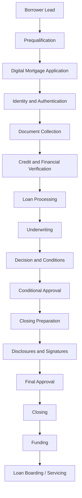
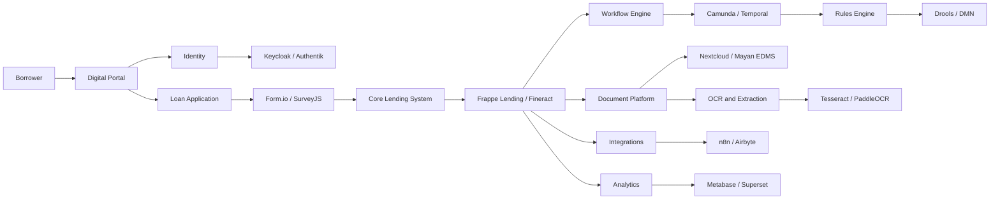
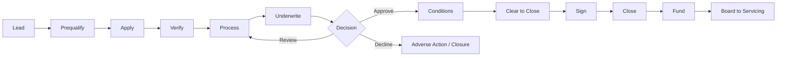

# Awesome-Mortgage-Origination

## Top Mortgage Origination Platform Ecosystem

**Curated List of SaaS Products & Open-Source GitHub Projects**

*Focused on Mortgage Loan Origination, Digital Applications, Borrower Portals, Underwriting Workflows, Loan Processing, Closing, Compliance & Lending Automation*

**Last updated: August 2026**

This repository tracks notable **SaaS/hosted platforms** and **open-source projects** for **Mortgage Origination and Loan Origination Systems (LOS)**. These platforms help mortgage lenders, banks, credit unions, brokers and other financial institutions manage the mortgage lifecycle from borrower application and document collection through processing, underwriting, approval, closing and funding.

Typical Mortgage Origination capabilities include **digital borrower applications, loan pipelines, borrower portals, document collection, income and asset verification, credit workflows, underwriting, product and pricing workflows, compliance checks, disclosures, e-signatures, closing coordination, integrations and reporting**.

**Examples** include Blend, Roostify, Byte Software, ICE Mortgage Technology Encompass, LendingPad, SimpleNexus, Finastra Mortgagebot, Mortgage Cadence, TurnKey Lender and MeridianLink.

**Open-source emphasis**: This section is heavily expanded with open-source lending platforms, loan-management systems, CRM systems, workflow engines, document platforms, identity systems, low-code application builders, analytics tools and integration frameworks. A fully featured, US mortgage-specific open-source LOS is relatively rare because commercial mortgage origination products depend heavily on proprietary credit, AUS, compliance, disclosure, title and secondary-market integrations. However, a substantial self-hosted mortgage origination platform can be assembled from open-source lending and business-process components.

Contributions welcome! Open a PR to add/update entries. Keep descriptions factual and link to official sites or GitHub repositories.

## Table of Contents

* [SaaS/Hosted Platforms](#saashosted-platforms)

* [Open-Source GitHub Projects](#open-source-github-projects)

* [Additional Strong Open-Source Options](#additional-strong-open-source-options)

* [Frameworks for Building Custom Mortgage Origination Systems](#frameworks-for-building-custom-mortgage-origination-systems)

* [How to Contribute](#how-to-contribute)

* [Disclaimer](#disclaimer)

## SaaS/Hosted Platforms

| Product | Description | Starting Pricing | Free Tier / Free Trial Limits |
| :--- | :--- | :--- | :--- |
| **[Blend](https://blend.com/)** | Digital origination platform for banks, credit unions, and mortgage providers supporting modern borrower applications, workflow automation, and consumer lending. | Starts at ~$80/user/month for entry point-of-sale licenses; enterprise lending deployments start from ~$1,500/month (or ~$50–$100/loan). | 14-day guided proof-of-concept / sandbox trial with sample loan workflow access on sales approval (no free forever tier). |
| **[Roostify](https://www.roostify.com/)** | Digital mortgage point-of-sale platform focused on borrower experience, mobile applications, document collection, and loan collaboration. | Starts at ~$1,000/month base platform fee for community lenders (or tiered at ~$15–$30/submitted application). | 14-day guided proof-of-concept environment for evaluating digital intake workflows (no free forever tier). |
| **[Byte Software](https://www.bytesoftware.com/)** | Mortgage loan origination system (BytePro) providing loan workflow management, broker connectivity, compliance checks, and secondary marketing. | Starts at ~$100/user/month (standard single-user desktop) or ~$800/month base server deployment. | 30-day evaluation trial license with sample mortgage pipeline and test loan files (no free forever tier). |
| **[ICE Mortgage Technology Encompass](https://www.icemortgagetechnology.com/)** | Enterprise loan origination system (LOS) covering application, automated underwriting, compliance, closing, and secondary market delivery. | Starts at ~$1,000/month base platform fee plus ~$40–$120/closed loan for mid-market lenders. | 30-day ICE Developer Connect sandbox access with up to 100 test loan API transactions (no free forever tier). |
| **[LendingPad](https://www.lendingpad.com/)** | Cloud-based mortgage LOS designed for brokers, lenders, and institutions supporting real-time collaborative processing and underwriting. | Broker Edition starts at $55/user/month; Lender Edition starts at ~$100/closed loan. | 14-day guided interactive sandbox demo with preloaded pipeline and test borrower records (no free forever tier). |
| **[SimpleNexus](https://www.simplenexus.com/)** | Mobile-first digital mortgage POS platform (by nCino) connecting borrowers, loan officers, and realtors across the loan lifecycle. | Starts at ~$150/user/month (or ~$1,200/month base subscription for small lending teams). | 14-day guided test portal with pre-configured borrower application flow (no free forever tier). |
| **[Finastra Mortgagebot](https://www.finastra.com/)** | Point-of-sale and loan origination technology providing end-to-end digital lending workflows for banks and credit unions. | Starts at ~$1,500/month base subscription for community financial institutions. | 30-day API evaluation sandbox on Finastra FusionFabric.cloud with mock lending endpoints (no free forever tier). |
| **[Mortgage Cadence](https://www.mortgagecadence.com/)** | Enterprise mortgage platform (MCP) supporting configurable loan origination, document management, and closing operations. | MCP Essentials starts at ~$1,200/month; Enterprise tier priced by annual closed loan volume. | 30-day guided evaluation sandbox instance with prebuilt workflow templates (no free forever tier). |
| **[TurnKey Lender](https://www.turnkey-lender.com/)** | Automated lending platform supporting AI-powered loan origination, decisioning, underwriting, servicing, and collections. | Standard tier starts at $500/month (or volume tier starting at ~$10/originated loan). | 14-day free trial with full sandbox environment access and up to 50 test loan applications. |
| **[MeridianLink Mortgage](https://www.meridianlink.com/)** | Digital lending and mortgage origination platform providing automated underwriting, compliance verification, and closing workflows. | Starts at ~$500/month base platform subscription plus per-application transaction fees. | 30-day developer sandbox environment for integration testing and API validation (no free forever tier). |
| **[nCino Mortgage](https://www.ncino.com/)** | Cloud banking and mortgage origination platform providing automated workflow management across consumer and commercial lending. | Starts at ~$2,000/month base enterprise package for financial institutions. | 14-day sales-guided Proof of Value (PoV) sandbox instance (no free forever tier). |
| **[Floify](https://www.floify.com/)** | Mortgage POS and automation platform for borrower portals, 1003 applications, automatic document requests, and milestone tracking. | Starter/Individual plan starts at $70/user/month (Team plan starts at $175/month). | 14-day free trial with unlimited test loan creation and full document portal capabilities. |
| **[Tavant](https://tavant.com/)** | AI-powered Touchless Lending platform providing modular digital origination, document classification, and automated underwriting. | Modular lending services start at ~$2,500/month (or ~$25/processed document package). | 30-day pilot API sandbox with up to 100 automated document extraction runs (no free forever tier). |
| **[Dark Matter Technologies](https://www.darkmattertech.com/)** | Empower LOS platform delivering high-performance origination, integrated pricing engine (PPE), and secondary marketing capabilities. | Bundled LOS packages start at ~$2,000/month base tier (or volume pricing starting at ~$65/closed loan). | 30-day guided test sandbox environment for qualified mortgage lenders (no free forever tier). |
| **[Calque](https://www.calqueinc.com/)** | Mortgage platform providing "Buy Before You Sell" solutions and guaranteed backup contracts for home purchase workflows. | Free lender partner onboarding ($0/month subscription); borrower fee is $2,000 admin fee + 1% Purchase Price Guarantee upon home sale. | Free forever partner access with zero upfront fees or loan limits; transaction fees apply strictly upon closed transactions. |
| **[ICE Mortgage Technology Consumer Connect](https://www.icemortgagetechnology.com/)** | Digital borrower POS and engagement platform connecting consumer applications directly into Encompass origination pipelines. | Starts at ~$300/month add-on base fee (or ~$10–$20/completed digital application). | 30-day test environment bundled within ICE Developer Connect sandbox (no free forever tier). |

## Open-Source GitHub Projects

### Dedicated Lending and Loan Origination Platforms

* **[Frappe Lending](https://github.com/frappe/lending)**

  Comprehensive open-source loan management system built on ERPNext and the Frappe Framework, supporting the lending lifecycle from loan origination through disbursement, repayment, accounting, collateral management and reporting.

* **[DigiFi Loan Origination System](https://github.com/getsan4u/loan-origination-system)**

  Open-source loan origination system architecture designed as modular lending components for consumer, residential, small-business and commercial lending workflows.

* **[FinStack No-Code LOS Architecture](https://github.com/FinStack-No-Code-LOS/Loan-Origination-System-Architecture)**

  Open-source architecture and implementation approach for building a Loan Origination System using free and open-source technologies and self-hosted infrastructure.

* **[LendFlow](https://github.com/Hruthik2311/LendFlow)**

  Open-source loan management and recovery application with multi-role access, loan tracking, payment workflows, notifications and reporting.

* **[Loan Origination System (Community Projects)](https://github.com/topics/loan-origination-system)**

  GitHub topic collection containing public Loan Origination System implementations, prototypes, architectures and supporting microservices.

* **[Apache Fineract](https://github.com/apache/fineract)**

  Major open-source core banking and financial-services platform supporting lending products, loans, repayments, accounting and financial operations.

* **[Mifos X](https://github.com/openMF/mifosx)**

  Open-source financial inclusion and lending platform built around Apache Fineract, suitable as a foundation for loan management and financial operations.

* **[Mifos Payment Hub](https://github.com/openMF/ph-ee-engine)**

  Open-source financial-services infrastructure that can support payment and financial integration workflows around lending platforms.

### Mortgage and Lending CRM Foundations

* **[SuiteCRM](https://github.com/salesagility/SuiteCRM)**

  Mature open-source CRM that can be customized for borrower management, mortgage lead pipelines, loan officer workflows and broker relationships.

* **[EspoCRM](https://github.com/espocrm/espocrm)**

  Open-source CRM platform suitable for managing borrowers, mortgage leads, brokers, loan opportunities and custom loan-origination entities.

* **[Twenty](https://github.com/twentyhq/twenty)**

  Modern open-source CRM platform that can be extended for borrower relationship management and lending workflow applications.

* **[Odoo](https://github.com/odoo/odoo)**

  Large open-source business application ecosystem with CRM, accounting, document, website and workflow capabilities that can serve as a foundation for custom lending operations.

* **[ERPNext](https://github.com/frappe/erpnext)**

  Open-source ERP platform providing accounting, CRM and business operations capabilities, forming the underlying foundation for Frappe Lending.

### Loan Application and Borrower Portal Builders

* **[Appsmith](https://github.com/appsmithorg/appsmith)**

  Open-source low-code platform for creating internal loan-processing applications, underwriter dashboards and borrower-facing operational interfaces.

* **[ToolJet](https://github.com/ToolJet/ToolJet)**

  Open-source low-code application builder suitable for creating loan-origination dashboards and custom mortgage operations tools.

* **[Budibase](https://github.com/Budibase/budibase)**

  Open-source platform for building data-driven applications such as borrower portals, loan-processing workflows and internal lending systems.

* **[NocoBase](https://github.com/nocobase/nocobase)**

  Open-source extensibility platform for building custom business applications, including configurable mortgage and lending workflows.

* **[Directus](https://github.com/directus/directus)**

  Open-source data platform providing APIs, authentication and administrative interfaces for custom borrower and loan applications.

* **[Strapi](https://github.com/strapi/strapi)**

  Open-source headless platform suitable for building borrower portals, mortgage content systems and API-driven lending applications.

* **[Drupal](https://github.com/drupal/drupal)**

  Mature open-source CMS and application framework suitable for authenticated borrower portals, broker portals and mortgage information systems.

### Workflow and Business Process Automation

* **[n8n](https://github.com/n8n-io/n8n)**

  Open-source workflow automation platform useful for automating mortgage applications, document requests, CRM synchronization, notifications and approval workflows.

* **[Node-RED](https://github.com/node-red/node-red)**

  Open-source flow-based programming platform suitable for integrating mortgage systems, APIs and event-driven lending workflows.

* **[Activepieces](https://github.com/activepieces/activepieces)**

  Open-source automation platform that can connect loan applications, CRMs, document systems and communication services.

* **[Windmill](https://github.com/windmill-labs/windmill)**

  Open-source workflow and developer platform useful for building underwriting workflows, operational tools and automated loan processes.

* **[Apache Airflow](https://github.com/apache/airflow)**

  Open-source workflow orchestration platform suitable for scheduled lending data pipelines and large-scale processing tasks.

* **[Temporal](https://github.com/temporalio/temporal)**

  Open-source durable workflow platform useful for building reliable, long-running mortgage origination workflows involving multiple systems and human approvals.

* **[Camunda](https://github.com/camunda/camunda)**

  Open-source business process and workflow automation platform suitable for modeling loan approval, underwriting and exception-management processes.

* **[Flowable](https://github.com/flowable/flowable-engine)**

  Open-source BPMN and workflow engine useful for configurable mortgage origination and loan-processing workflows.

### Forms and Digital Applications

* **[Formbricks](https://github.com/formbricks/formbricks)**

  Open-source form and survey platform useful for borrower intake, prequalification questionnaires and mortgage application workflows.

* **[SurveyJS](https://github.com/surveyjs/survey-library)**

  Open-source form and survey framework suitable for building custom multi-step mortgage application experiences.

* **[OhMyForm](https://github.com/ohmyform/ohmyform)**

  Open-source form platform that can be used for borrower inquiries, lead capture and preliminary loan applications.

* **[Form.io](https://github.com/formio/formio)**

  Open-source form and data-management framework suitable for building configurable digital loan applications and workflow forms.

### Document Management and Mortgage Files

* **[Nextcloud](https://github.com/nextcloud/server)**

  Open-source collaboration and document-management platform suitable for securely managing loan documents and borrower file exchanges.

* **[Paperless-ngx](https://github.com/paperless-ngx/paperless-ngx)**

  Open-source document-management system that can assist with organizing, indexing and searching scanned lending documents.

* **[Mayan EDMS](https://github.com/mayan-edms/Mayan-EDMS)**

  Mature open-source enterprise document-management system suitable for document-heavy lending workflows.

* **[OpenKM Community](https://github.com/openkm/document-management-system)**

  Open-source document-management platform providing document repositories and workflow capabilities.

* **[Docspell](https://github.com/eikek/docspell)**

  Open-source document-management and document-organization platform useful for self-hosted document processing workflows.

### Document Extraction and OCR

* **[Tesseract OCR](https://github.com/tesseract-ocr/tesseract)**

  Major open-source OCR engine that can support extraction of text from scanned mortgage and financial documents.

* **[PaddleOCR](https://github.com/PaddlePaddle/PaddleOCR)**

  Open-source OCR toolkit supporting document text extraction and AI-assisted document processing.

* **[OCRmyPDF](https://github.com/ocrmypdf/OCRmyPDF)**

  Open-source tool for adding searchable OCR layers to scanned PDF documents.

* **[Unstructured](https://github.com/Unstructured-IO/unstructured)**

  Open-source document-processing framework useful for extracting structured content from lending and financial documents.

### Identity and Access Management

* **[Keycloak](https://github.com/keycloak/keycloak)**

  Open-source identity and access management platform supporting single sign-on, multi-factor authentication and role-based access control.

* **[Authentik](https://github.com/goauthentik/authentik)**

  Open-source identity provider suitable for securing borrower, broker and lender applications.

* **[ZITADEL](https://github.com/zitadel/zitadel)**

  Open-source identity and access management platform supporting modern authentication and organizational access controls.

### E-Signature and Agreement Infrastructure

* **[Documenso](https://github.com/documenso/documenso)**

  Open-source electronic-signature platform suitable for self-hosted document-signing workflows.

* **[OpenSign](https://github.com/OpenSignLabs/OpenSign)**

  Open-source electronic-signature solution that can be integrated into loan and mortgage document workflows.

* **[DocuSeal](https://github.com/docusealco/docuseal)**

  Open-source document-signing and form-completion platform suitable for configurable lending document workflows.

### Data Integration and Lending APIs

* **[Airbyte](https://github.com/airbytehq/airbyte)**

  Open-source data integration platform for synchronizing lending, CRM, accounting, borrower and analytics systems.

* **[Meltano](https://github.com/meltano/meltano)**

  Open-source ELT and data integration platform suitable for lending data pipelines and reporting.

* **[Apache NiFi](https://github.com/apache/nifi)**

  Open-source data-flow platform useful for integrating high-volume lending, document and operational systems.

* **[Apache Camel](https://github.com/apache/camel)**

  Open-source integration framework suitable for connecting heterogeneous banking and mortgage systems.

* **[Kestra](https://github.com/kestra-io/kestra)**

  Open-source orchestration platform useful for data pipelines and lending workflow automation.

### API Infrastructure

* **[Kong Gateway](https://github.com/Kong/kong)**

  Open-source API gateway useful for managing integrations between borrower portals, lending engines and third-party financial services.

* **[Apache APISIX](https://github.com/apache/apisix)**

  Open-source API gateway supporting scalable and programmable lending-system integrations.

* **[Hasura](https://github.com/hasura/graphql-engine)**

  Open-source GraphQL engine useful for rapidly exposing lending data through controlled APIs.

* **[PostgREST](https://github.com/PostgREST/postgrest)**

  Open-source tool for automatically exposing PostgreSQL databases through RESTful APIs.

### Analytics and Lending Operations

* **[Metabase](https://github.com/metabase/metabase)**

  Open-source analytics platform suitable for loan pipeline, application, underwriting and operational dashboards.

* **[Apache Superset](https://github.com/apache/superset)**

  Open-source business intelligence platform suitable for large-scale mortgage and lending analytics.

* **[Grafana](https://github.com/grafana/grafana)**

  Open-source visualization platform useful for operational monitoring and lending performance dashboards.

* **[Lightdash](https://github.com/lightdash/lightdash)**

  Open-source analytics platform for self-service lending and mortgage business intelligence.

* **[Redash](https://github.com/getredash/redash)**

  Open-source query and visualization platform suitable for loan portfolio and operational reporting.

### Rules, Decisioning and Automation Foundations

* **[Drools](https://github.com/kiegroup/drools)**

  Open-source business rules engine suitable for implementing configurable eligibility, underwriting and decision rules.

* **[OpenL Tablets](https://github.com/openl-tablets/openl-tablets)**

  Open-source business rules and decision management platform useful for spreadsheet-like lending rules.

* **[KIE DMN](https://github.com/kiegroup/drools)**

  Open-source decision-modeling capabilities suitable for transparent loan eligibility and workflow decisioning.

* **[Open Policy Agent](https://github.com/open-policy-agent/opa)**

  Open-source policy engine that can enforce authorization and policy rules across lending-system services.

## Additional Strong Open-Source Options

* **Dedicated lending systems**: Frappe Lending, DigiFi Loan Origination System, Apache Fineract, Mifos X and community Loan Origination System projects.

* **CRM foundations**: SuiteCRM, EspoCRM, Twenty, Odoo and ERPNext.

* **Borrower and operations portals**: Appsmith, ToolJet, Budibase, NocoBase, Directus and Drupal.

* **Business process management**: Temporal, Camunda, Flowable, n8n and Node-RED.

* **Digital applications**: Formbricks, SurveyJS, Form.io and OhMyForm.

* **Document management**: Nextcloud, Paperless-ngx, Mayan EDMS, OpenKM and Docspell.

* **OCR and document intelligence**: Tesseract, PaddleOCR, OCRmyPDF and Unstructured.

* **Identity management**: Keycloak, Authentik and ZITADEL.

* **Electronic signatures**: Documenso, OpenSign and DocuSeal.

* **Rules and decision engines**: Drools, OpenL Tablets, DMN and Open Policy Agent.

* **Data integration**: Airbyte, Meltano, Apache NiFi and Apache Camel.

* **Analytics**: Metabase, Apache Superset, Grafana, Lightdash and Redash.

* **API infrastructure**: Kong, Apache APISIX, Hasura and PostgREST.

* Many specialized open-source components can be combined for **borrower onboarding, document collection, workflow routing, underwriting rules, loan processing, compliance evidence and operational reporting**.

## Frameworks for Building Custom Mortgage Origination Systems

A practical open-source Mortgage Origination architecture can combine:

**Core Lending Engine** → Frappe Lending / Apache Fineract

**Borrower CRM** → SuiteCRM / EspoCRM / Twenty

**Borrower Portal** → NocoBase / Appsmith / Drupal

**Mortgage Application** → Form.io / SurveyJS

**Workflow Engine** → Temporal / Camunda / Flowable

**Rules Engine** → Drools / OpenL Tablets

**Document Management** → Nextcloud / Mayan EDMS

**Document OCR** → Tesseract / PaddleOCR

**E-Signatures** → Documenso / DocuSeal

**Identity Management** → Keycloak / Authentik

**Automation** → n8n / Node-RED

**Data Integration** → Airbyte / Apache NiFi

**Analytics** → Metabase / Apache Superset

**API Layer** → Kong / Hasura / PostgREST

A strong general-purpose self-hosted lending stack could be:

**Frappe Lending + ERPNext + Keycloak + n8n + Nextcloud + Metabase**

For a highly configurable mortgage workflow platform:

**Apache Fineract + Camunda + SuiteCRM + Form.io + DocuSeal + Superset**

For a lightweight digital lending MVP:

**Twenty + Formbricks + NocoBase + n8n + Keycloak + Metabase**

For document-intensive mortgage processing:

**Frappe Lending + Mayan EDMS + PaddleOCR + Temporal + Documenso**

## Mortgage Origination Workflow

## Open-Source Mortgage Origination Architecture

## Mortgage Origination Data Model

A typical Mortgage Origination System may include:

* Borrower

* Co-Borrower

* Applicant

* Household

* Loan Application

* Mortgage Loan

* Loan Product

* Loan Program

* Property

* Property Address

* Collateral

* Loan Officer

* Mortgage Broker

* Processor

* Underwriter

* Credit Report

* Income Record

* Employment Record

* Asset Record

* Liability

* Bank Account

* Document

* Document Request

* Verification

* Condition

* Underwriting Decision

* Loan Estimate

* Disclosure

* Closing Package

* Signature

* Closing Agent

* Title Provider

* Appraisal

* Appraisal Provider

* Interest Rate

* Pricing

* Loan Status

* Loan Milestone

* Compliance Check

* Audit Record

* Integration

* Workflow

* Notification

## Common Mortgage Origination Features

A complete Mortgage Origination platform may support:

* Mortgage lead capture

* Borrower onboarding

* Digital applications

* Prequalification

* Preapproval

* Loan product selection

* Mortgage pricing

* Borrower portals

* Broker portals

* Loan officer dashboards

* Co-borrower collaboration

* Identity verification

* Income verification

* Asset verification

* Employment verification

* Credit workflows

* Document collection

* Document checklists

* OCR and document extraction

* Loan processing

* Underwriting workflows

* Business rules

* Eligibility rules

* Automated decisioning

* Manual underwriting

* Conditions management

* Compliance checks

* Disclosures

* Electronic signatures

* Appraisal workflows

* Title workflows

* Closing preparation

* Funding workflows

* CRM integration

* Accounting integration

* API integrations

* Workflow automation

* Audit trails

* Role-based access

* Reporting

* Loan pipeline analytics

## Mortgage Origination Lifecycle

## AI-Assisted Mortgage Origination

Potential AI-assisted capabilities include:

* Borrower document classification

* Income document extraction

* Bank statement analysis

* Application data validation

* Missing-document detection

* Loan file summarization

* Underwriter assistance

* Condition recommendations

* Fraud anomaly detection

* Mortgage pipeline forecasting

* Loan officer assistance

* Borrower support assistants

* Automated document checklists

* Data-quality validation

* Natural-language reporting

* Workflow prioritization

A recommended architecture is:

**Mortgage Data → Rules and Workflow Engine → AI Assistance → Human Loan Officer / Underwriter Review**

AI-generated recommendations should remain subject to appropriate human review and regulatory controls, particularly for credit decisions, underwriting, fair-lending assessments and adverse-action determinations.

## Mortgage Origination KPIs

Useful Mortgage Origination metrics include:

* Application volume

* Completed application rate

* Prequalification conversion

* Preapproval conversion

* Loan approval rate

* Pull-through rate

* Application-to-close time

* Time to underwriting

* Time to clear conditions

* Time to close

* Cost per originated loan

* Loan officer productivity

* Processor productivity

* Underwriter turnaround time

* Document completion rate

* Digital application completion

* Borrower satisfaction

* Fall-out rate

* Funding rate

* Pipeline value

* Pipeline velocity

* Exception rate

* Rework rate

* Compliance exception rate

* Automation rate

## How to Contribute

1. Fork the repo.

2. Add/edit entries in `README.md` following the existing format.

3. Include: name, link, a 1–2 sentence description and whether it is SaaS/hosted or open-source.

4. Clearly indicate whether an open-source project is a complete lending platform, loan-management system, LOS prototype, CRM foundation or supporting component.

5. Prefer actively maintained projects with clear licenses and documentation.

6. Submit a PR with a short explanation.

Star the repo if you find it useful!

## Disclaimer

* This is a **community-curated** list — not exhaustive and not an endorsement.

* Mortgage Origination Systems are subject to significant regulatory, jurisdictional and institutional requirements.

* Some open-source projects listed here are complete lending platforms, while others are components or frameworks for building a custom Mortgage Origination System.

* A general-purpose open-source lending platform may not include jurisdiction-specific mortgage integrations, credit reporting, automated underwriting, disclosure generation, title workflows or secondary-market connectivity.

* Loan eligibility, underwriting and credit decisions should not rely solely on automated or AI-generated recommendations.

* Organizations should independently validate regulatory, fair-lending, privacy, security, accounting and data-retention requirements.

* Self-hosted systems handling borrower financial or personally identifiable information require strong encryption, access control, monitoring, audit logging, backup and incident-response procedures.

---

**Made for mortgage lenders, banks, credit unions, fintech companies, loan officers, developers and financial technology teams building modern lending infrastructure.**

Let's make mortgage origination more **open, interoperable, transparent, automatable and data-driven**.
